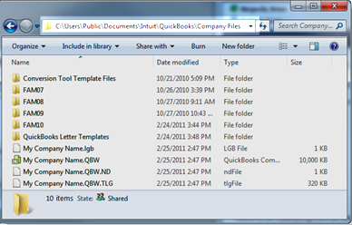
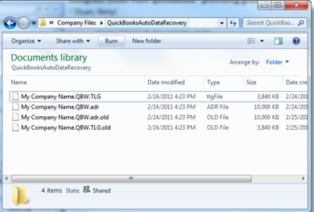
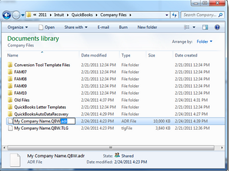

# Quickbooks Recovery Process

## Step 1 - QuickBooks File Doctor (15 minutes)

* Ensure the issue isn’t related to basic corruption or installation errors.  <i>*** This may alread have been done.</i> 

## Step 2 - Recreate lost transactions using the current QuickBooks Transaction Log (.QBW.tlg) file and a previous copy of the QuickBooks Company (.QBW) file from December

*** Backup current .QBW and .QBW.tlg files in new directory `C:\Users\Public\Public Documents\Intuit\QuickBooks\Company Files\Backup 01272025`, copy .QBW and .QBW.tlg into it.

1) Using Windows Explorer open the folder where your QuickBooks Company (.QBW) file is stored.
<!--  -->

2) If file extensions are not visible, make them visible (Uncheck `Hide extensions for known file types`)

3) Note the size and date modified for both your QuickBooks Company (.QBW) file and the QuickBooks Transaction Log (.QBW.tlg) file.

4) Within your Company Files folder, create a new folder named `Backup 01272025`

5) Cut your QuickBooks Company (.QBW) file from your Company Files folder, and

6) Paste your QuickBooks Company (.QBW) file into the newly created `Backup 01272025` folder

7) Locate and open the QuickBooksAutoDataRecovery folder within your Company Files folder

8) Identify all files within the QuickBooksAutoDataRecovery folder – the number of files may vary depending on several factors. (Files are typically produced every 12 hours. Newer files will have file extensions of .adr appended to their normal file extensions.  Older files will have file extensions of .adr.old appended to their normal file extensions  Note the date, time and size of each file.)
<!--  -->

9) Copy the file ending in .QBW.adr and return to your QuickBooks Company Files folder

10) Paste the file you just copied into your QuickBooks Company Files folder

11) Rename the .QBW.adr file so as to remove the .adr extension from the name; the renamed file should only have an extension of .QBW (this file has now replaced your prior QuickBooks Company file) within the Company Files folder.
<!--  -->
12) Open QuickBooks

13) Open your Company file – as you do this the QuickBooks Database Server will scan all transactions within your current QuickBooks Transaction Log (.QBW.tlg) file (which remained in the Company Files folder) that have been added since the data/time the ADR file was created. Those files should be automatically appended to your QuickBooks Company file as it is opened restoring the file.

14) Run the Verify Data utility, Review the QBWin.log if Verify Does not complete normally.

15) Use reports and/or account registers to manually verify all restored transactions.
**Title**: [QuickBooks Auto Data Recovery – Part 2: Using the Current QB](https://insightfulaccountant.com/accounting-tech/general-ledger/quickbooks-auto-data-recovery-%E2%80%93-part-2%3A-using-the-current-qb/)
**Source**: Insightful Accountant
**Published on**: *March 8, 2015 10:31 PM*
**Accessed on**: *January 27, 2025*

## Step 3 - (If Step 2 fails) QuickBooks Auto Data Recovery - Using ADR File Sets
1) Using an Auto Data Recovery file-set to recover all but the last few hours of transactions.
    * Backup current .QBW and .QBW.tlg files in new directory `C:\Users\Public\Public Documents\Intuit\QuickBooks\Company Files\Backup 01272025_2`, copy .QBW and .QBW.tlg into it.
1) Using Windows Explorer open the folder where your QuickBooks Company (.QBW) file is stored.

2) If file extensions are not visible, make them visible (see the Windows operating instructions for your version of the Windows-OS if you are not familiar with this step.)

3) Note the size and date modified for both your QuickBooks Company (.QBW) file and the QuickBooks Transaction Log (.QBW.tlg) file.

4) Within your Company Files folder, create a new folder named `Backup 01272025_2`

5) Cut your QuickBooks Transaction Log (.QBW.tlg) file from your Company Files folder, and

6) Paste your QuickBooks Transaction Log (.QBW.tlg) file into the newly created `Backup 01272025_2` folder

7) Cut your QuickBooks Company (.QBW) file from your Company Files folder, and

8) Paste your QuickBooks Company (.QBW) file into the newly created `Backup 01272025_2` folder.

9) Locate and open the QuickBooksAutoDataRecovery folder within your Company Files folder

10) Identify all files within the QuickBooksAutoDataRecovery folder – the number of files may vary depending on several factors. (Files are typically produced every 12 hours. Newer files will have file extensions of .adr appended to their normal file extensions.  Older files will have file extensions of .adr.old appended to their normal file extensions  Note the date, time and size of each file.)

11) Copy the file ending in .QBW.tlg.adr and return to your QuickBooks Company Files folder

12) Paste the file you just copied into your QuickBooks Company Files folder

13) Rename the .QBW.tlg.adr ffile so as to delete the .adr file extension from the end of the file you just pasted into the file folder. The renamed file should now only have an extension of .QBW.tlg (this file has now replaced your prior QuickBooks Transaction Log file).

13) Return to the QuickBooksAutoDataRecovery folder

14) Copy the file ending in .QBW.adr and return to your QuickBooks Company Files folder

15) Paste the file you just copied into your QuickBooks Company Files folder

16) Rename the QBW.adr file so as to delete the .adr file extension from the end of the file you just pasted into the file folder. The renamed file should now only have an extension of .QBW (this file has now replaced your prior QuickBooks Company file).

17) Open QuickBooks

18) Open your Company file – as you do this the QuickBooks Database Server will scan both the .QBW and .QBW.tlg files you just restored from the ADR folder and will confirm that both files have matching data. You file should open normally and you will be back in business as of the date and time of the files when they were replicated.

19) Run the Verify Data utility, Review the QBWin.log if Verify Does not complete normally.

20) Use reports and/or account registers to manually verify all restored transactions. Remember this data will be as many as 12-hours earlier than your prior corrupted data file; as such it will NOT contain all information which had been incorporated into that file.  It will be necessary to re-construct data previously added to your older file.

(Note: If you find that this restored set of data also contains the same corruptions, you may need to repeat these steps using the 'older' set of data withing the Auto Data Recovery file folder.  While the file names will also include .old in the exponent of each file, the procedure for restoration is identical with the exception that you will need to change file extensions to also remove the .old portion of the extension from the file names, in addition to removing the .adr portion of the extension from the file names.)

## Step 4 - (If Steps 2 and 3 fail) Use Stellar Repair
* https://cloud.stellarinfo.com/StellarRepairforQuickBooksSoftware-A.exe?_ga=2.119774792.1355178001.1737990812-442019885.1737990812
